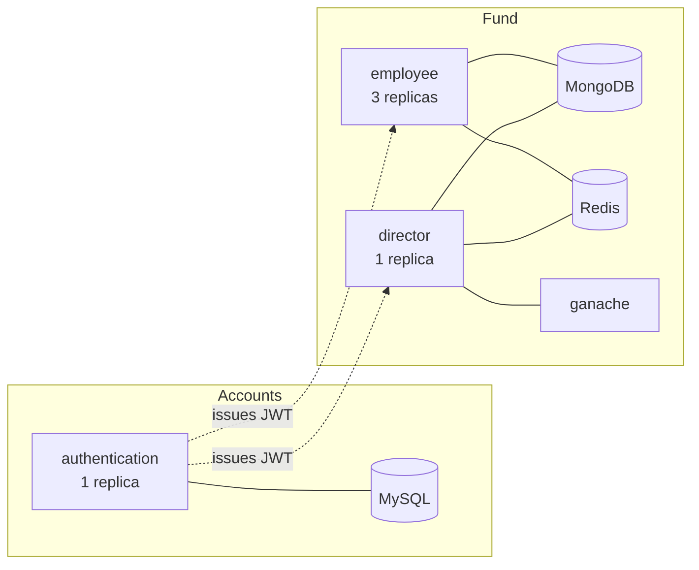
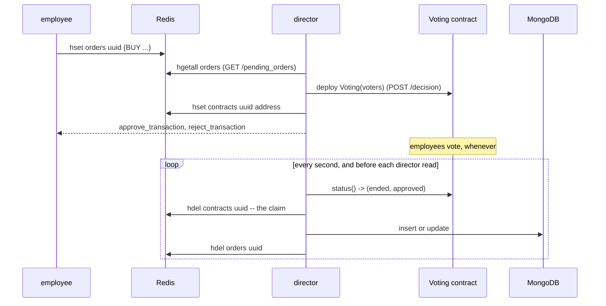

# Architecture

A reference for the whole system: what every file is for, what shape the data takes, and how a
request travels from a browser to a database and back. [`SETUP.md`](SETUP.md) is how to run it,
[`ROADMAP.md`](ROADMAP.md) is why each decision was made, and [`DEFENSE.md`](DEFENSE.md) is the
runbook for the day.

## The shape of the system



Three web services, four images (the fourth is the one-shot migration job). Nothing calls anything
else over HTTP: the only thing shared between the services is the JWT signing key, so a token issued
by `authentication` verifies inside `employee` and `director` without either of them asking.

| Service | Reads and writes | Owns |
|---|---|---|
| `authentication` | MySQL | users, roles, and the tokens everything else trusts |
| `employee` | MongoDB, Redis | asset search; proposing purchases and sales |
| `director` | MongoDB, Redis, Ethereum | listing proposals, opening votes, reporting, and the vote poller |

## Source files

Everything lives flat in `src/`. It is not a package: each service imports its neighbours as
`from configuration import Configuration`, which keeps `python src/employee.py` working with no
install step and lets each dockerfile copy single files, so an image never ships another service's
code.

| File | Lines | What it is |
|---|---|---|
| `configuration.py` | ~54 | Every setting, read from the environment with a localhost default |
| `models.py` | ~46 | `User`, `Role`, and the `UserRole` join table |
| `validation.py` | ~44 | The shared ordered-check helpers |
| `decorators.py` | ~25 | `role_check`, used by `employee` and `director` |
| `authentication.py` | ~107 | `/register`, `/login`, `/delete` |
| `employee.py` | ~164 | `/search`, `/create_buy_order`, `/create_sell_order` |
| `director.py` | ~250 | `/pending_orders`, `/decision`, `/report`, and the poller |
| `utilities.py` | ~95 | web3 helpers: deploy, build ballots, read status |
| `migrate.py` | ~52 | Creates the tables and seeds the director. Runs as a Job |

### `configuration.py`

One class, read by `application.config.from_object(Configuration)`. Every value is
`os.environ.get(NAME, default)`, and the defaults describe `deploy/development.yaml` running on the
host, so a bare `python src/employee.py` works with nothing set.

Two entries are worth knowing:

- `DATABASE_URL` falls back to `127.0.0.1`, **not** `localhost`. `mysqlclient` reads the literal
  string `localhost` as "use the unix socket" and never opens a TCP connection at all.
- `SQLALCHEMY_ENGINE_OPTIONS = {"pool_pre_ping": True}`. Kubernetes gives a replaced MySQL pod a new
  address; without a liveness check on checkout, every pooled connection still points at the pod
  that is gone and every request fails until the service is restarted by hand.

### `validation.py`

Three helpers and a regex, and the reason they exist is that **the order of checks is graded**. Every
endpoint in the spec ends with *"Odgovarajuće provere se vrše u navedenom redosledu"*, so a request
that breaks two rules at once must report the first one.

```python
missing_field(body, ["forename", "surname", "email", "password"])  # -> first bad name, or None
missing_field_message("email")  # -> "Field email is missing."
valid_email(value)  # format only
valid_price(value)  # a number, not a bool, > 0
valid_uuid(value)
```

`missing_field` tests `name not in body` and then `isinstance(value, str) and len(value) == 0`, and
nothing else. **Never rewrite it as a truthiness check**: `buying_price: 0` and `categories: []` are
both falsy, both valid inputs, and both have their own separate error message that a truthiness test
would steal.

`valid_price` excludes `bool` by hand, because `isinstance(True, int)` is `True` in Python.

`valid_email` requires at least two characters after the last dot, so `john@gmail.a` is rejected.

### `decorators.py`

```python
@application.route("/report", methods=["GET"])
@role_check("director")
def report(): ...
```

`role_check` wraps the view in `@jwt_required()`, so a request with no header gets
`flask_jwt_extended`'s own `401 {"msg": "Missing Authorization Header"}` — the exact body the spec
asks for, which is why it is not overridden. A token for the wrong role gets the same answer: the
spec describes only the missing-header case, and a token that does not authorize this route is worth
no more than no token at all.

### `models.py`

```
users:      id, forename(256), surname(256), email(256, unique), password(256)
roles:      id, name                      -- "director" and "employee"
user_role:  id, user_id -> users.id, role_id -> roles.id
```

Many-to-many through `secondary=UserRole.__table__`, so `user.roles` works and deleting a user clears
its junction rows on its own. **There is deliberately no `cascade`** on that relationship: adding one
cascades into the `Role` rows instead, so deleting an employee would delete the `employee` role and
the next registration would fail.

Passwords are stored as `werkzeug.security.generate_password_hash` output — `scrypt:32768:8:1`, a 162
character string that fits the 256 column.

## Data

### An asset, in MongoDB

```python
{
    "_id": ObjectId,
    "name": str,
    "categories": [str],
    "buying_price": number,
    "buying_date": datetime,  # BSON datetime in UTC, never a string
    "selling_price": number,  # absent until sold
    "selling_date": datetime,  # absent until sold
    "info": {...},  # free form, arbitrarily nested
}
```

Two rules hold this together:

- **Dates are BSON datetimes, in UTC.** `datetime.now(UTC)`, never a bare `datetime.now()`, which
  returns naive local time that MongoDB then stores as if it were UTC — two hours wrong on a CEST
  machine, and every date range search wrong with it.
- **On the way out**, `format_iso` emits `value.isoformat(timespec="milliseconds") + "Z"`, which
  reproduces the spec's `2026-06-08T22:12:00.000Z` exactly. This works only because PyMongo hands
  back *naive* datetimes by default, so do not pass `tz_aware=True` to `MongoClient` or the result
  ends in `+00:00Z`.

An asset is **sold** when it has both `selling_price` and `selling_date`. `/decision` only ever
writes the pair together.

### An order, in Redis

One hash, `orders`, keyed by a fresh `uuid4`, values are JSON. That gives create, list and delete in
one call each.

```python
{"order_type": "BUY", "name": ..., "categories": [...], "buying_price": ..., "info": {...}}
{"order_type": "SELL", "id": "<ObjectId as string>", "selling_price": ...}
```

A second hash, `contracts`, maps an order's uuid to the address of the `Voting` contract deployed for
it. That hash is the registry the poller walks, and its entry doubles as the claim token — see below.

`hgetall` returns bytes for both keys and values, hence `key.decode()` and `json.loads(value)`.

## The endpoints

Errors are `400` with `{"message": "..."}`; a missing or wrong-role token is `401` with
`{"msg": "Missing Authorization Header"}`. The checks below run **in the order listed**, returning on
the first failure.

| Method | Route | Role | Checks, in order |
|---|---|---|---|
| `POST` | `/register` | public | field missing → `Invalid email.` → `Invalid password.` (len < 8) → `Email already exists.` |
| `POST` | `/login` | public | field missing → `Invalid email.` → `Invalid credentials.` |
| `POST` | `/delete` | any | `Unknown user.` |
| `POST` | `/search` | employee | none; every field is optional |
| `POST` | `/create_buy_order` | employee | field missing → `Categories list is empty.` → `Invalid buying price.` |
| `POST` | `/create_sell_order` | employee | field missing → `Invalid id.` → `Invalid selling price.` |
| `GET` | `/pending_orders` | director | none |
| `POST` | `/decision` | director | `Field uuid is missing.` → `Invalid uuid.` → `Field voters is missing.` → `Invalid voter address.` → `Even number of voters.` |
| `GET` | `/report` | director | none |

Three of those messages cover two failures each: `Invalid id.` fires for a malformed `ObjectId` *and*
for one that matches no asset; `Invalid uuid.` for a malformed UUID *and* for one with no order in
Redis; `Invalid buying price.` for "not a number" *and* for "not greater than zero".

### `/search`

Every filter is pushed into one MongoDB query — the spec asks for PyMongo to be used
*"u što većoj meri"*, and filtering a list in Python instead is a deduction.

```python
conditions = []
if name is not None:
    conditions.append({"name": {"$regex": re.escape(name)}})
if category is not None:
    conditions.append({"categories": category})
if buying_date is not None:
    conditions.append({"buying_date": {"$gt": parse_iso(buying_date)}})
if selling_date is not None:
    conditions.append({"selling_date": {"$lt": parse_iso(selling_date)}})
for f in info_filters:
    conditions.append({f"info.{f['field']}": {f"${f['operator']}": f["value"]}})

query = {"$and": conditions} if conditions else {}
```

- `{"categories": category}` matches **inside** the array; MongoDB compares a scalar against every
  element, so no `$elemMatch`.
- `$and` rather than one flat dict, because two `info_filters` on the same path would otherwise
  collide as duplicate keys and the second would silently win.
- `{"selling_date": {"$lt": ...}}` excludes unsold assets for free: a document missing the field
  never matches a range query, which is exactly the rule the spec states.
- The operator arrives without its `$`, and the dotted path is relative to `info`.
- Optional fields are read with `body.get(name) is not None`, so an explicit JSON `null` is treated
  as "not given" rather than reaching `parse_iso` and raising — `/search` has no error body to return.

### `/report`

```python
[
    {"$unwind": "$categories"},
    {
        "$group": {
            "_id": "$categories",
            "spent": {"$sum": "$buying_price"},
            "earned": {"$sum": {"$cond": [SOLD, "$selling_price", 0]}},
        }
    },
    {"$sort": {"earned": -1, "spent": 1, "_id": 1}},
    {"$project": {"_id": 0, "category": "$_id", "spent": 1, "earned": 1}},
]
```

`$unwind` is what implements *"ako imovina pripada većem broju kategorija, računa se u statistiku
svake"*: one document becomes N, each contributing its full price to a different group. That is the
spec's rule, not double counting.

`SOLD` tests that both `selling_price` and `selling_date` are present, so an asset the fund still
holds contributes its buying price to `spent` and nothing to `earned`. The restricting sentence in
the spec names only *"obračun zarade"*, the earnings.

`$sort` stays **before** `$project` so it can still see `_id`.

## The voting flow

This is the part with no request behind it. Employees vote at a moment the director service takes no
part in, so the conclusion has to be *noticed* rather than handled inline.



`contracts/voting.sol` holds the list of allowed voters, one vote each, and concludes as soon as
either side reaches `n / 2 + 1`. Its `can_vote` modifier checks `!ended` **before** `allowed[...]`,
so a stranger arriving after the conclusion hears `"Voting ended."` rather than `"Invalid address."` —
the spec asks for *every* late attempt to be refused that way.

The contract is compiled ahead of time and its artifacts are committed, as every course example does:

```
solc --evm-version istanbul --abi --bin --overwrite -o contracts/output contracts/voting.sol
```

`--evm-version istanbul` is mandatory. The assignment mandates the `trufflesuite/ganache-cli` image,
which is ganache 6 and rejects the `PUSH0` opcode current `solc` emits by default.

### The two returned transactions

`/decision` answers with `to`, `data`, `gas`, `gasPrice` and `chainId` — and deliberately **no `from`
and no `nonce`**, because the sender is not known when the contract is deployed: any of the allowed
voters may cast either ballot, and a nonce is per account. The voter fills those in before signing.
The official grader takes exactly `to` and `data` and supplies the rest itself.

### Settling exactly once

```python
if redis.hdel(Configuration.REDIS_CONTRACTS, order_uuid) == 0:
    continue
```

`HDEL` answers with the number of fields it removed, so of everyone racing for a concluded contract
exactly one gets a `1`. The registry entry **is** the claim token, and everything after that line runs
once per vote. That is what makes it safe for both the poller thread and the request path to settle,
which is why `/pending_orders` and `/report` call `settle()` before answering and never show stale
state. `settle()` swallows chain errors, so an unreachable ganache degrades to "a second stale"
rather than a 500.

The poller reads each contract inside its own `try`, so one unreadable address cannot stop the
contracts behind it from ever being looked at again.

## Configuration

Everything is an environment variable. In Kubernetes the non-secret half lives in one `ConfigMap` and
the passwords plus the JWT key in one `Secret`, both consumed with `envFrom`, so there is exactly one
place where any of them is written down.

| Variable | Default | Used by |
|---|---|---|
| `PRODUCTION` | unset | all — when set, bind `0.0.0.0` instead of `localhost` |
| `PORT` | `5000` | all |
| `JWT_SECRET_KEY` | `development-secret-key` | all three; **must be the same value** |
| `DATABASE_USERNAME` / `_PASSWORD` / `_URL` / `_NAME` | `root` / `root` / `127.0.0.1` / `investment_fund` | authentication, migration |
| `MONGO_HOST` / `_PORT` / `_USERNAME` / `_PASSWORD` / `_AUTH_SOURCE` / `_DATABASE` / `_ASSETS` | `localhost` / `27017` / `root` / `example` / `admin` / `investment_fund` / `assets` | employee, director |
| `REDIS_HOST` / `_PORT` / `_ORDERS` | `localhost` / `6379` / `orders` | employee, director |
| `REDIS_CONTRACTS` | `contracts` | director |
| `BLOCKCHAIN_URL` | `http://127.0.0.1:8545` | director |

## Deployment

`deploy/k8s.yaml` is one multi-document manifest, so the whole system is a single `kubectl apply`.

| Object | Notes |
|---|---|
| `ConfigMap` + `Secret` | one of each, `envFrom` on every pod, including the databases' own bootstrap variables |
| `PersistentVolume` + `PersistentVolumeClaim` ×2 | MySQL and MongoDB, `Retain`, `storageClassName: ""` with an explicit `volumeName` for static binding |
| `Deployment` mysql, mongo | `strategy: Recreate` — the claims are `ReadWriteOnce`, and a rolling update would deadlock waiting for the old pod to release the volume |
| `Deployment` redis, ganache | no volume; Redis holds only *privremene informacije* by the spec's own words |
| `Job` migration-job | a busybox initContainer blocks on `nc -z mysql-service 3306` first |
| `Deployment` authentication, director | 1 replica each |
| `Deployment` employee | **3 replicas**, as the spec requires |
| `Service` ×7 | `ClusterIP` for the databases; `NodePort` 30000/30001/30002 for the services and 30003 for ganache |

Image policies are deliberate in both directions: `Never` on the four locally built images, so a typo
can never make Kubernetes pull a stranger's image called `employee` and so a missing image fails
immediately with `ErrImageNeverPull`; `IfNotPresent` on the four public ones, so a slow or filtered
network cannot stop a node that already has them.

`mongo` is pinned to `7`. The 8.x images refuse to start on Linux kernel 6.19 and newer
([SERVER-121912](https://jira.mongodb.org/browse/SERVER-121912)), which is what Docker Desktop now
runs — and the symptom is not obviously about MongoDB at all: `/search` hangs for PyMongo's full
thirty second server-selection timeout and `/report` answers 500, while `/pending_orders` stays fast
because it only touches Redis.

The databases are `Deployment`s rather than the bare `Pod`s the course examples use, because nothing
recreates a deleted Pod and the persistence demo is *"delete the database pod and show the data
survived"*.

## Tests

174 tests in `tests/`, all of which talk to real services — there is no mongomock, no fakeredis, no
eth-tester. Isolation is by name: `conftest.py` points every service at `_test` suffixed databases and
Redis keys, so a run never touches what `development.yaml` is serving.

| File | Covers |
|---|---|
| `test_authentication.py` | register, login, delete, claim contents, token lifetime |
| `test_employee_search.py` | every filter, regex escaping, exclusive boundaries, the exact `.000Z` format |
| `test_orders.py` | both create endpoints and `/pending_orders`, including the exact response shapes |
| `test_voting.py` | `/decision` validation order, deployment, the poller, and the contract's own reverts |
| `test_report.py` | the aggregation, and all three sort keys |
| `test_validation.py`, `test_configuration.py` | pure unit tests, no services needed |
| `test_models.py`, `test_infrastructure.py` | the ORM relationships, and that the services are reachable |

Services build their Flask app, Mongo handle and Redis handle at **import time**, so a test that wants
one pointed elsewhere patches `Configuration` and then `importlib.reload`s the module. Never hold a
module-level reference to the `Configuration` class in test code: every reload binds a new class
object, and anything holding the old one silently patches a class nobody reads.

`scenario.py` is the other half — an end-to-end exercise of all nine endpoints including a full
three-voter ballot, written to run against any deployment.
