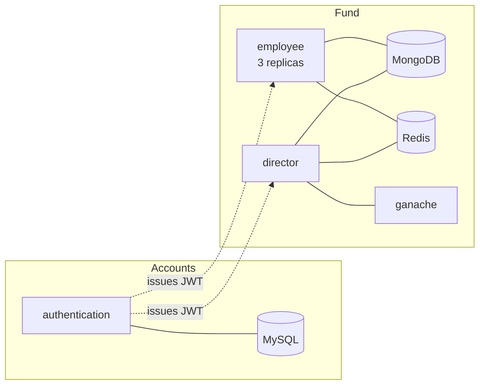

# Investment Fund Management System

A microservice system for an investment fund: employees search the fund's assets and propose
purchases and sales, and a director opens those proposals to a majority vote held on an Ethereum
smart contract. Approved proposals are written to MongoDB, rejected ones are discarded.

Built for the Engineering of Information Processing course at the School of Electrical Engineering,
University of Belgrade. The full assignment is in
[`docs/Projekat/IEP_Projekat_2026.md`](docs/Projekat/IEP_Projekat_2026.md).

Python, Flask, SQLAlchemy, PyMongo, Redis, Solidity, Docker, Kubernetes.

## How it works



Three web services, each its own container image:

| Service | Stores | Responsibilities |
|---|---|---|
| `authentication` | MySQL | Registration, login, account deletion. Issues the JWT everything else trusts. |
| `employee` | MongoDB, Redis | Asset search, and proposing purchases and sales. Runs in three replicas. |
| `director` | MongoDB, Redis, Ethereum | Reviewing proposals, opening votes, and reporting. Runs the vote poller. |

A proposal is not applied when the director acts on it. It becomes a `Voting` contract deployed for
that one order, and the employees named as voters cast their ballots whenever they like. A poller in
the director watches each live contract and, once a majority lands, writes the asset to MongoDB and
retires the order. Nobody has to call the service again for that to happen.

## API

Every route below the first three needs `Authorization: Bearer <token>`, and each is restricted to
one role. Errors are `400` with `{"message": "..."}`; a missing header is `401`.

| Method | Route | Role | Purpose |
|---|---|---|---|
| `POST` | `/register` | public | Create an employee account |
| `POST` | `/login` | public | Exchange credentials for a one hour access token |
| `POST` | `/delete` | any | Delete your own account |
| `POST` | `/search` | employee | Query assets by name, category, date range and arbitrary nested fields |
| `POST` | `/create_buy_order` | employee | Propose a purchase |
| `POST` | `/create_sell_order` | employee | Propose a sale |
| `GET` | `/pending_orders` | director | List proposals awaiting a vote |
| `POST` | `/decision` | director | Deploy a voting contract and return the ballot transactions |
| `GET` | `/report` | director | Spend and earnings per category |

`/search` pushes every filter into a single MongoDB query, including dotted paths into an asset's
free-form `info` object, for example `{"field": "engine.power", "operator": "gt", "value": 100}`.
`/report` uses an aggregation pipeline that unwinds categories, so an asset belonging to several of
them counts in full towards each.

## Documentation

| | |
|---|---|
| [`SETUP.md`](SETUP.md) | how to install, run and test it, on Windows and on Unix, and what to do when it breaks |
| [`ARCHITECTURE.md`](ARCHITECTURE.md) | every file, every data shape, every request path, in depth |
| [`ROADMAP.md`](ROADMAP.md) | the implementation plan, and why each decision was made |
| [`DEFENSE.md`](DEFENSE.md) | the runbook and demo script for the day, with the reasoning to say out loud |
| [`MODIFIKACIJE.md`](MODIFIKACIJE.md) | the live-modification playbook, with ready patterns |
| [`KOMANDE.md`](KOMANDE.md) | one page of every command, for the day itself |

## Running it

Docker is the only requirement; Python on the host is optional. All commands run from the
repository root. [`SETUP.md`](SETUP.md) covers all of this in far more detail, including Windows.

```sh
sh pokreni.sh        # everything, in containers        (Windows: pokreni.cmd)
sh pokreni-k8s.sh    # everything, on Kubernetes        (Windows: pokreni-k8s.cmd)
sh testovi.sh        # the 174 tests, in a container    (Windows: testovi.cmd)
sh resetuj.sh        # empty the databases              (Windows: resetuj.cmd)
sh oceni.sh          # the official grader              (Windows: oceni.cmd)
sh deploy/proveri.sh director /report    # one route, with a token
```

The four images build with no network: `wheels/` is committed alongside the source and pip installs
with `--no-index`, so only the seven public base images have to come from anywhere. `spakuj-wheels.sh`
regenerates them if `requirements.txt` changes.

### Local development

```bash
python -m venv venv && source venv/bin/activate
pip install -r requirements-dev.txt

docker compose -f deploy/development.yaml up -d   # MySQL, MongoDB, Redis, ganache, adminer
python src/migrate.py                             # create the tables, seed the director

PORT=5000 python src/authentication.py
PORT=5001 python src/employee.py
PORT=5002 python src/director.py
```

On macOS port 5000 is taken by AirPlay Receiver, which answers with an empty `403`. Use another
port and point the scenario at it.

### Everything in containers

```bash
docker compose -f deploy/deployment.yaml up -d --build
```

Published on `5000`, `5001` and `5002` by default; override with `AUTHENTICATION_PORT`,
`EMPLOYEE_PORT` and `DIRECTOR_PORT`.

### Kubernetes

```bash
docker compose -f deploy/deployment.yaml build   # the four images must exist locally
sh deploy/load-images.sh                         # put them in the cluster's own image store
kubectl apply -f deploy/k8s.yaml
```

One multi-document manifest brings up the whole system: settings in a `ConfigMap`, passwords and the
JWT signing key in a `Secret`, persistent volumes for both databases, a migration `Job` that seeds
the initial director, and the employee service at three replicas.

Images are consumed with `imagePullPolicy: Never`, so a cluster with its own image store (kind, k3d,
Docker Desktop's Kubernetes) needs them imported first, which is what `deploy/load-images.sh` does
for each of those clusters in turn. [`DEFENSE.md`](DEFENSE.md) is the runbook for bringing the whole
thing up on a machine it was not built on, and [`ROADMAP.md`](ROADMAP.md#54-done-when) has the
cluster specific notes behind it.

### The contract

`contracts/voting.sol` is committed alongside its compiled artifacts. To rebuild them:

```bash
solc --evm-version istanbul --abi --bin --overwrite -o contracts/output contracts/voting.sol
```

`--evm-version istanbul` is required. The assignment mandates the `trufflesuite/ganache-cli` image,
which is ganache 6 and rejects the `PUSH0` opcode that current `solc` emits by default.

## Tests

```bash
python -m pytest                      # 172 tests, needs deploy/development.yaml running
python -m pytest -m "not integration" # only the tests that need no services
```

The integration tests point every service at `_test` suffixed databases and a separate Redis key, so
a run never touches development data.

`scenario.py` is an end to end exercise of every endpoint, including a full vote, written to run
against any deployment:

```bash
python scenario.py                                        # defaults to localhost:5000/5001/5002
AUTHENTICATION_URL=http://localhost:5100 python scenario.py
```

Each run tags its own accounts and assets, so it can be replayed against a live system without
resetting anything.

## Layout

```
src/          the three services, the migration job, and their shared modules
contracts/    voting.sol and its compiled abi and bytecode
deploy/       one dockerfile per service, both compose files, k8s.yaml and the helper scripts
tests/        pytest suite
scenario.py   end to end exercise of every endpoint
ROADMAP.md    the implementation plan, and why each decision was made
DEFENSE.md    runbook, demo script and the reasoning behind each judgement call
MODIFIKACIJE.md  the live-modification playbook, with ready aggregation patterns
pokreni.sh    one command: build, start, and report where everything is listening
pokreni-k8s.sh  the same on Kubernetes, including the port-forwards
```

`.cmd` versions of all three sit next to them, because the defense machines run Windows.

[`ROADMAP.md`](ROADMAP.md) is worth reading alongside the code. It records the reasoning behind the
design and the traps found along the way, from validation ordering that changes which error a
request gets, to storing dates in UTC so range queries agree with reality.
