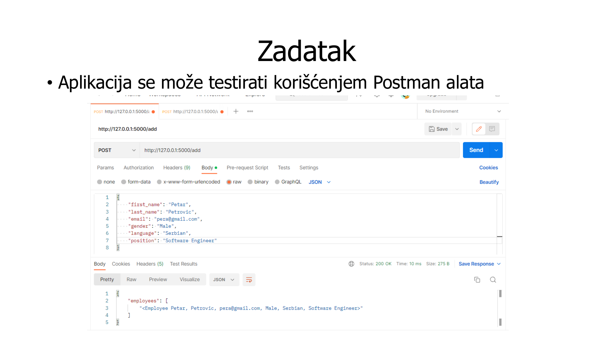
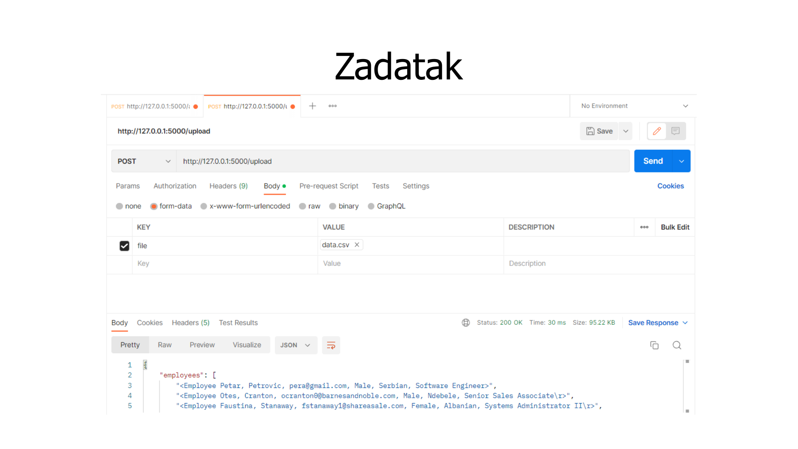
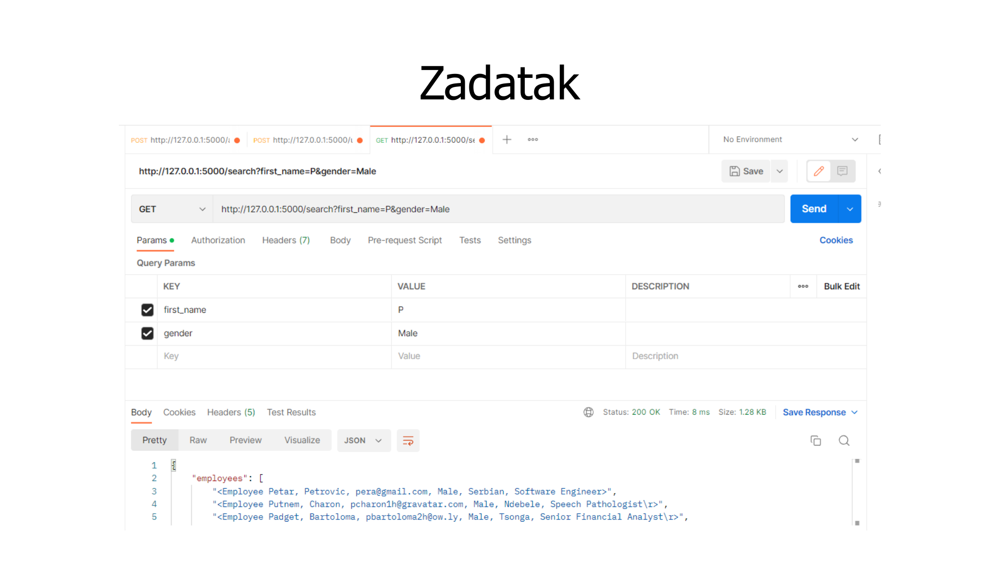

<!-- _class: lead -->

# Flask

---

## Flask

- Web framework
- Kreirao ga je Amin Ronacher
- Zasnovan je na `Werkzeug` WSGI toolkit-u i `Jinja2` template engine-u
- Često ga nazivaju micro framework-om
- Ne sadrži ugrađene module za rad sa bazom podataka, validaciju podataka i slično, ali se oni mogu lako dodati

---

## Flask - minimalna aplikacija

```python
from flask import Flask

app = Flask(__name__)

@app.route("/")
def hello_world():
    return "Hello, World!"

if __name__ == "__main__":
    app.run()
```

```bash
python -m venv ./venv
./venv/Scripts/activate
pip install flask
python script.py
```

- Nakon pokretanja, aplikacija je dostupna na `http://127.0.0.1:5000`

---

## Flask

- Objekat klase `Flask` predstavlja WSGI aplikaciju
- `app.route(rule, options)` je dekorater koji vezuje funkciju za određeni URL
    - `rule` predstavlja URL adresu za koju se vezuje funkcija
    - `options` predstavlja dodatne parametre, na primer HTTP metodu
- `app.run(host, port, debug, options)` pokreće aplikaciju
    - `host` je adresa na kojoj se može pristupiti aplikaciji
    - `port` je port na kojem se može pristupiti aplikaciji
    - `debug` određuje da li se aplikacija izvršava u debug režimu
    - `options` sadrži dodatne parametre koji se prosleđuju Werkzeug serveru

---

## Flask - rutiranje

```python
@app.route("/")
def index():
    return "Index Page"

@app.route("/projects/")
def projects():
    return "The project page"

@app.route("/hello")
def hello():
    return "Hello, World"

@app.route("/about")
def about():
    return "The about page"
```

- Pristup adresama `localhost/hello/` i `localhost/about/` proizvodi grešku `404 Not Found`
- Pristup adresama `localhost/projects` i `localhost/projects/` vodi do funkcije `projects`

---

## Flask - rutiranje

- Bolja organizacija ruta može se postići korišćenjem `Blueprint` objekata

```python
from flask import Blueprint, Flask
from . import blueprint

bp = Blueprint("foo", __name__, url_prefix="/foo")

@bp.route("/bar")
def bar():
    return "bar"

app = Flask(__name__)
app.register_blueprint(blueprint.bp)

if __name__ == "__main__":
    app.run(debug=True)
```

---

## Flask - rutiranje

- Dozvoljeno je ugneždavanje `Blueprint` objekata

```python
parent = Blueprint("parent", __name__, url_prefix="/parent")
child = Blueprint("child", __name__, url_prefix="/child")

parent.register_blueprint(child)
app.register_blueprint(parent)
```

```python
url_for("parent.child.create")  # /parent/child/create
```

---

## Flask - rutiranje

- Moguće je proslediti parametre kroz putanju
- Dodatno, moguće je navesti način konverzije za prosleđene parametre

```python
from markupsafe import escape

@app.route("/user/<forename>/<surname>")
def show_user_profile(forename, surname):
    return f"User {forename} {surname}"

@app.route("/post/<int:post_id>")
def show_post(post_id):
    return f"Post {post_id}"

@app.route("/path/<path:subpath>")
def show_subpath(subpath):
    return f"Subpath {escape(subpath)}"
```

---

## Flask - rutiranje

- Konverteri za parametre u putanji

| Konverter | Opis |
| --- | --- |
| `string` | Podrazumevani tip, prihvata tekst bez `/` |
| `int` | Prihvata pozitivne cele brojeve |
| `float` | Prihvata pozitivne realne brojeve |
| `path` | Kao `string`, ali prihvata i `/` |
| `uuid` | Prihvata UUID stringove |

---

## Flask - request objekat

- Globalni objekat `request` sadrži podatke vezane za tekući zahtev
- Najčešće korišćeni atributi su `args`, `json`, `files` i `method`

```python
from flask import request

@app.route("/login", methods=["POST", "GET"])
def login():
    if request.method == "POST":
        ...
    else:
        ...

    return "SUCCESS"
```

---

## Flask - request objekat

- `request.files` predstavlja rečnik prosleđenih datoteka
- Svaka datoteka sadrži stream objekat preko kog je moguće pročitati sadržaj

```python
@app.route("/upload", methods=["POST"])
def upload():
    content = request.files["file"].stream.read()
    return content.decode()
```

- Datoteke je moguće sačuvati na serveru uz dodatnu konfiguraciju preko `app.config["UPLOAD_FOLDER"]` i `app.config["MAX_CONTENT_PATH"]`

---

## Flask - povratne vrednosti

- Povratne vrednosti su predstavljene objektom klase `Response`
- Objekat nije potrebno kreirati ručno, dovoljno je pozvati `make_response`

```python
from flask import make_response

@app.route(...)
def foo():
    response = make_response(...)
    response.headers["X-Something"] = "A value"
    return response
```

---

## Flask - povratne vrednosti

- Povratna vrednost funkcije se automatski pretvara u objekat klase `Response`

**Pravila konverzije:**

- Ako je povratna vrednost `Response`, direktno se vraća klijentu
- Ako je povratna vrednost string, kreira se `Response` sa statusnim kodom `200`
- Iterator ili generator koji vraća stringove ili bajtove tretira se kao tok podataka
- Rečnik ili lista pretvaraju se pomoću funkcije `jsonify`
- Torka mora biti oblika `(response, status)`, `(response, headers)` ili `(response, status, headers)`

---

## Flask - konfiguracija aplikacije

- Postoji predefinisan skup promenljivih okruženja koji utiče na rad aplikacije

**Vrednosti se mogu definisati na više načina:**

- Direktnim upisom u `config` atribut objekta klase `Flask`
- Dodelom vrednosti na nivou operativnog sistema
- Učitavanjem vrednosti iz datoteke
- Definisanjem vrednosti u okviru Python klasa

```python
app.config.from_object(yourapplication.default_settings)
```

---

## Flask - kontekst aplikacije i zahteva

- Prilikom obrade zahteva kreiraju se kontekst aplikacije i kontekst zahteva
- Po završetku obrade, ovi konteksti se brišu
- Mehanizam pomaže u rešavanju problema kružne zavisnosti između modula
- Pristup kontekstima moguć je preko globalnih promenljivih `current_app` i `request`
- Za rad van obrade zahteva, kontekst je potrebno ručno kreirati

```python
app = Flask(__name__)

with app.app_context():
    init_db()
```

---

## Flask - logovi

- Logovi su korisni za nadgledanje sistem i reprodukciju grešaka radi lakšeg otklanjanja istih
- Flask koristi Python `logging` modul

```python
@app.route("/login", methods=["POST"])
def login():
    user = get_user(request.form["username"])

    if user.check_password(request.form["password"]):
        login_user(user)
        app.logger.info("%s logged in successfully", user.username)
        return redirect(url_for("index"))

    app.logger.info("%s failed to log in", user.username)
    abort(401)
```

---
## Flask - logovi

- Svakoj poruci se dodelju prioritet:
    - predefinisan skup vrednost ```DEBUG```, ```INFO```, ```WARNING```, ```ERROR```, ```CRITICAL```
    - najmanji prioritet ima ```DEBUG```, a najveći ```CRITICAL```
- Podrazumevano se ispisuju poruke ```WARNING``` ili većeg prioriteta
    - Može se promeniti programski dohvatanjem objekta koji predstavlja taj loger i promenom tog objekta
```python
logging.getLogger("werkzeug").setLevel(logging.INFO)
```
---

## Flask - logovi

- Postoji jedan podrazumevani loger, moguće je dodati korisničke logere (uz dodatnu konfiguraciju)

```python
from logging.config import dictConfig
dictConfig({
    "version": 1,
    "formatters": {
        "default": { "format": "[%(asctime)s] %(levelname)s in %(module)s: %(message)s", }
    },
    "handlers": {
        "wsgi": {
            "class": "logging.StreamHandler",
            "stream": "ext://flask.logging.wsgi_errors_stream",
            "formatter": "default",
        }
    },
    "root": {
        "level": "INFO",
        "handlers": ["wsgi"],
    },
})
```


---

## Flask - sesije

- HTTP je stateless protokol, pa se svaki zahtev obrađuje nezavisno od prethodnih
- Informacije bitne za korisnika mogu se čuvati u okviru sesije
- Sesiji se pristupa preko globalne promenljive `session`

---

## Flask - primer koriscenja sesije

```python
from flask import request, redirect, session, url_for

app.secret_key = b'_5#y2L"F4Q8z\n\xec]/'

@app.route("/")
def index():
    if "username" in session:
        return f'Logged in as {session["username"]}'

@app.route("/login", methods=["POST"])
def login():
    session["username"] = request.form["username"]
    return redirect(url_for("index"))

@app.route("/logout")
def logout():
    session.pop("username", None)
    return redirect(url_for("index"))
```

---

## Zadatak

- Napisati jednostavnu veb aplikaciju koja korisnicima omogućava dodavanje podataka o zaposlenima i pretragu nad istim podacima
    - Za svakog zaposlenog čuvaju se ime, prezime, email adresa, pol, jezik kojim govori i pozicija
    - Omogućiti dodavanje pojedinačnih zaposlenih
    - Omogućiti dodavanje zaposlenih putem CSV datoteke
    - Omogućiti pretragu po svim atributima

---



---



---



---

## Validacija podataka

- Svi podace treba da budu provereni pre bilo koje akcije
    - Proverava se da li su neophodna polja zahteva (telo, query string) prisutna, njihove tipove i da li su u odgovarajućem formatu
- U slučaju nekorektnih podataka potrebno je obezbediti povratnu informacije o tome
- Ne postoji rešenje u okviru `flask` modula, potrebno je korsititi dodatne biblioteke kao što je `pydantic`

---

## Pydantic

- `Pydantic` modul omogućava definisanje pravila validacije na jednostavan način korišćenjem modela
- Isti model može da proveri prisustvo obaveznih polja, proveri tipove i specifične formate kao što su imejl adrese
- Ovo čini hendlere ruta (route handlers) kraćim i olakšava ponovnu upotrebu pravila validacije
```python
from pydantic import BaseModel, EmailStr
class EmployeeCreate(BaseModel):
    first_name: str
    last_name: str
    email: EmailStr
    gender: str
    language: str
    position: str
```

---

## Flask + Pydantic rimer
```python
from pydantic import ValidationError
@app.route("/add", methods=["POST"])
def add():
    try:
        payload = EmployeeCreate.model_validate(request.get_json())
    except ValidationError as error:
        return jsonify(error=error.errors()), 400
    new_employee = Employee(**payload.model_dump())
    database.session.add(new_employee)
    database.session.commit()
    return jsonify(employee=str(new_employee))
```

- Validacija treba da se desi pre bilo kakve akcije i potrebno vratiti preciznu informaciju o nedostacima
- Isti princip se može iskoristiti u druge svrhe kao što je pisanje testova
