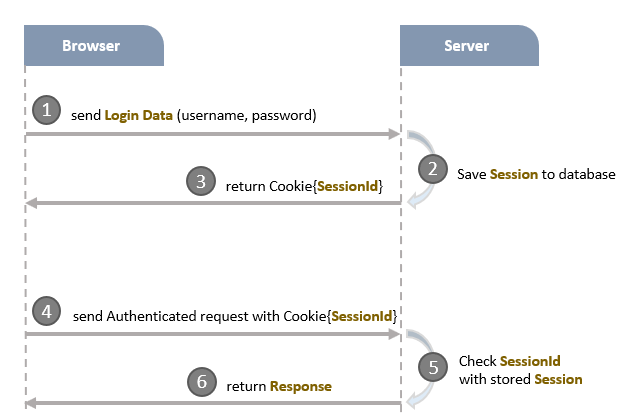
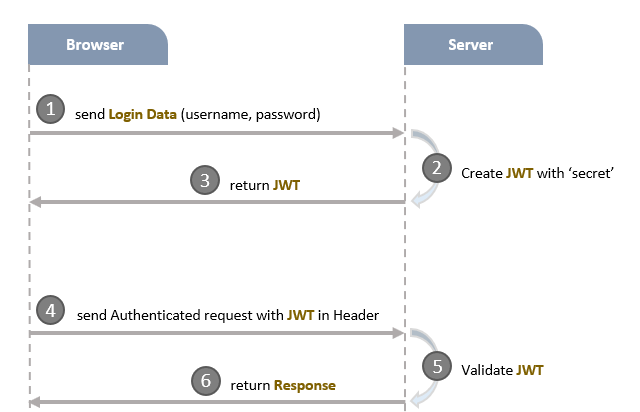
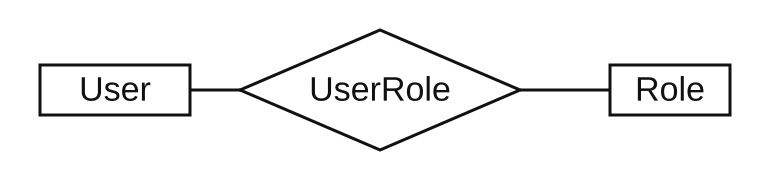
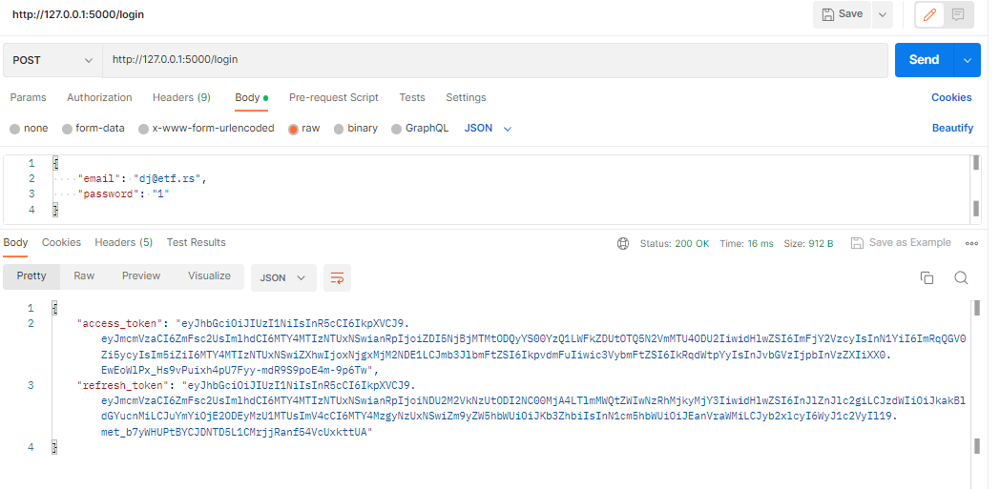
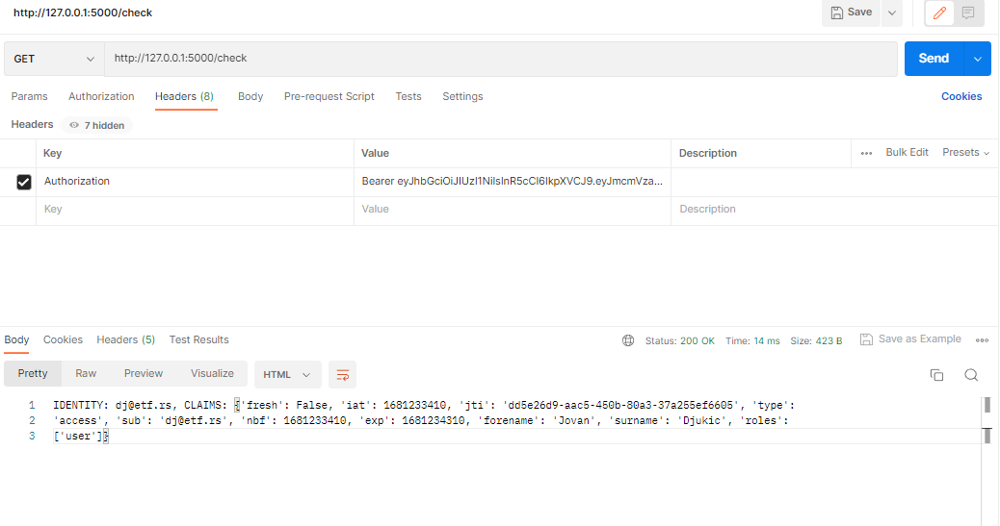

<!-- _class: lead -->

# JWT

## JSON Web Tokens

---

## Sesije

<style scoped>
ul { font-size: 0.8em; }
</style>

- Autentikacija i autorizacija su sastavni delovi skoro svih aplikacija sa kojima se susrećemo
- Svaki korisnik mora da ima nalog u okviru sistema koji se koristi za sprovođenje autentikacije i autorizacije
- Jednostavan način za implementaciju ova dva mehanizma zasnovan je na sesijama
- Pre pristupa sistemu, korisnik mora da dostavi kredencijale na osnovu kojih se vrše neophodne provere
- Ukoliko postoji odgovarajući korisnički nalog i korisnik poseduje neophodne privilegije, za datog korisnika se kreira sesija, a korisniku se dostavlja identifikator sesije
- Prilikom svakog narednog pristupa, korisnik šalje dati identifikator uz ostale podatke, najčešće kroz kolačiće

---

## Sesije



---

## JWT

- Međutim, dati mehanizam ima dosta nedostataka: raznolikost platformi, skaliranje infrastrukture i slično
- Ovo je dovelo do kreiranja mehanizama autentikacije i autorizacije koji su zasnovani na tokenima
- Prilikom prijave, korisnik šalje kredencijale na osnovu kojih se kreira token koji se vraća korisniku
- Kreirani token je deo svakog narednog zahteva, obično u zaglavlju
- Jedna vrsta ovih tokena jesu JSON Web Tokens

---

## JWT



---

## JWT

- JWT je string koji se sastoji iz tri dela: zaglavlje, podaci i potpis
- Delovi tokena su razdvojeni tačkom

```text
header.payload.signature
```

- Zaglavlje daje informaciju o tome kako je formiran token
- Uglavnom sadrži dva polja:
  - `typ` definiše tip tokena
  - `alg` definiše algoritam koji je korišćen prilikom stvaranja potpisa

```json
{
  "typ": "JWT",
  "alg": "HS256"
}
```

---

## JWT

- Deo označen sa `payload` predstavlja podatke koje želimo da smestimo u okviru tokena
- Ovi podaci se često nazivaju `claims`
- Postoji predefinisani skup podataka koji mogu da se čuvaju
- Moguće je dodati i druge podatke

```json
{
  "userId": "abcd12345ghijk",
  "username": "bezkoder",
  "email": "contact@bezkoder.com",

  "iss": "zKoder, author of bezkoder.com",
  "iat": 1570238918,
  "exp": 1570238992
}
```

---

## JWT

- Potpis se kreira na osnovu zaglavlja i podataka i koristi se za verifikaciju tokena
- Zaglavlje i podaci se najpre pretvaraju u stringove korišćenjem Base64 kodiranja
- Potom se korišćenjem navedenog algoritma kreira potpis koji se dodaje tokenu
- Sam algoritam koristi tajni ključ, pa je replikacija potpisa nemoguća

```text
encodedHeader = base64urlEncode(header)
encodedPayload = base64urlEncode(payload)

data = encodedHeader + "." + encodedPayload
hashedData = Hash(data, secretKey)
signature = base64urlEncode(hashedData)

JWT = encodedHeader + "." + encodedPayload + "." + signature
```

---

## JWT

- Svaki zahtev korisnika u zaglavlju sadrži JWT token
- Pre obrade zahteva, na serveru se proverava ispravnost tokena
- Algoritam korišćen za kreiranje potpisa je takav da garantuje da je potpis jedinstven i da se ne može replicirati
- Potpis se kreira ponovo na osnovu zaglavlja i podataka prosleđenog tokena
- Ukoliko je kreirani potpis jednak prosleđenom, token je ispravan

---

## JWT

- JWT tokeni se mogu koristiti za implementaciju naprednijih mehanizama
- Umesto izdavanja jednog tokena koji ima kratak životni vek, mogu se izdati dva tokena
- `refresh token` ima značajno duži period važenja i koristi se za ponovno izdavanje novih tokena za pristup kada oni isteknu
- Moguće je implementirati Single Sign-On mehanizam i obezbediti korisniku pristup većem broju aplikacija uz samo jednu prijavu
- Postoji dosta biblioteka koje implementiraju funkcionalnosti neophodne za rad sa JWT tokenima
- `Flask-JWT-Extended` se može koristiti prilikom rada sa Flask aplikacijama

---

## Zadatak

- Napisati jednostavnu veb aplikaciju koja ilustruje autentikaciju i autorizaciju korišćenjem JWT tokena
- Iskoristiti sledeću strukturu tabela za smeštanje podataka



- Tabela `User` se koristi za smeštanje podataka o korisnicima
- Tabela `Role` sadrži informacije o ulogama određenih korisnika
- Uloga određuje prava pristupa

---

## Zadatak - dekorateri

- Privilegije korisnika su smeštene u okviru tokena, na primer kao lista stringova koji predstavljaju uloge
- Proveru privilegija je najlakše implementirati kroz dekorater
- Dekorater proverava da li je tražena uloga prisutna u dostavljenoj listi uloga
- Python programski jezik tretira funkcije kao objekte
- Funkcija može biti povratna vrednost druge funkcije
- Dekorateri su funkcije čija je povratna vrednost druga funkcija
- Koriste se kao omotači oko drugih funkcija i mogu da modifikuju ponašanje ili rezultat originalne funkcije

---

## Zadatak - dekorateri

<style scoped>
pre { font-size: 0.62em; margin: 0.3em 0; }
li { font-size: 0.9em; }
</style>

```python
def dashes_decorator(function_to_decorate):
    def wrapper():
        result = function_to_decorate()
        return "----" + str(result) + "-----"
    return wrapper
```

```python
@dashes_decorator
def foo():
    return "foo"

print(foo())
```

- Prethodni segment ima isti efekat kao ručno omotavanje funkcije

```python
def foo():
    return "foo"

decorated_function = dashes_decorator(foo)
print(decorated_function())
```

---

## Zadatak - dekorateri

```python
def dashes_decorator(function_to_decorate):
    def wrapper():
        result = function_to_decorate()
        return "----" + str(result) + "-----"
    return wrapper

def stars_decorator(function_to_decorate):
    def wrapper():
        result = function_to_decorate()
        return "****" + str(result) + "****"
    return wrapper

def decorator_with_an_argument(argument):
    def decorator(function_to_decorate):
        def wrapper():
            result = function_to_decorate()
            return str(argument) + str(result) + str(argument)
        return wrapper
    return decorator
```

---

## Zadatak - dekorateri

```python
@decorator_with_an_argument("IEP")
@dashes_decorator
@stars_decorator
def foo():
    return "foo"
```

- Dekorateri mogu imati svoje argumente
- Može se navesti više od jednog dekoratera
- Redosled primene je suprotan od redosleda navođenja

---

## Zadatak - dekorateri

- Prethodni dekorateri neće raditi za funkcije koje imaju svoje argumente
- Za opšti slučaj neophodan je sledeći dekorater

```python
def general_purpose_decorator(argument):
    def decorator(function_to_decorate):
        def wrapper(*function_args, **function_kwargs):
            result = function_to_decorate(
                *function_args,
                **function_kwargs,
            )
            return str(argument) + str(result) + str(argument)
        return wrapper
    return decorator
```

---

## Zadatak - dekorateri

- Dekorater koji proverava da li korisnik poseduje odgovarajuće privilegije, odnosno uloge

```python
from flask_jwt_extended import jwt_required, get_jwt
from functools import wraps

def role_check(role):
    def decorator(function):
        @jwt_required()
        @wraps(function)
        def wrapper(*args, **kwargs):
            claims = get_jwt()
            if role in claims["roles"]:
                return function(*args, **kwargs)
            else:
                return "Invalid role", 401
        return wrapper
    return decorator
```

---

## Zadatak - dekorateri

- Flask vezuje funkcije za određeni URL korišćenjem `__name__` atributa objekta funkcije
- Ovo dovodi do problema jer će se uvek koristiti `__name__` atribut funkcije `wrapper` prethodnog dekoratera
- Da bi se izbegao ovaj problem, prethodnom dekorateru se dodaje `wraps` dekorater iz `functools` modula
- `wraps` modifikuje atribut `__name__` funkcije `wrapper` tako što u njega upiše vrednost `__name__` atributa dekorisane funkcije

---

## Zadatak



---

## Zadatak

- Token se prosleđuje kao deo `Authorization` zaglavlja


