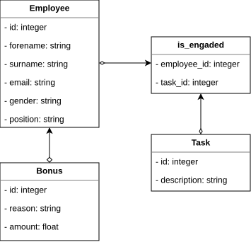

<!-- _class: lead -->

# SQLAlchemy

---

## SQLAlchemy

- ORM (Object-Relational Mapping) biblioteka
- Većina današnjih jezika je objektno orijentisana
- Podaci u bazi su smešteni u tabelama
- Za svaku tabelu se kreira klasa čiji atributi odgovaraju kolonama tabele
- Objekti klase predstavljaju konkretne redove
- Biblioteka namenjena za Flask se naziva `Flask-SQLAlchemy`
  - Omotač namenjen za Flask
  - Funkcioniše kao SQLAlchemy biblioteka

```bash
pip install flask-sqlalchemy
```

---

## SQLAlchemy - inicijalizacija

- Potrebno je definisati string za konekciju
  - Promenljiva okruženja `SQLALCHEMY_DATABASE_URI`
  - String sadrži informacije o tome gde se nalazi baza, kog je tipa i kredencijale za pristup
- Potrebno je napraviti objekat klase `SQLAlchemy` i inicijalizovati ga objektom aplikacije
  - Ova klasa sadrži tipove i atribute neophodne za rad sa bazom, kao što su klasa `Model` i atribut `session`
- Baza se može kreirati pozivom metode `create_all` (`Code first` pristup)
  - Ova metoda kreira tabele koje odgovaraju definisanim modelima
  - Izmene nad već postojećim tabelama rade se korišćenjem mehanizma migracija

---

## SQLAlchemy - inicijalizacija

- Preporučuje se korišćenje fabričke funkcije, mada nije neophodno

```python
def create_app(config_filename):
    app = Flask(__name__)
    app.config.from_pyfile(config_filename)

    from yourapplication.model import db

    db.init_app(app)
```

---

## SQLAlchemy - primer

```text
employees (id, forename, surname, email, gender, position)
tasks (id, description)
is_engaged (employee_id, task_id)
bonuses (id, reason, amount, employee_id)
```

---

## SQLAlchemy - primer

- Svaka tabela je predstavljena klasom
- Relacije primarni/strani ključ su predstavljene asocijacijama

<div style="display: flex; justify-content: center; width: 100%;">
  
</div>

---

## SQLAlchemy - primer

```python
class Employee(db.Model):
    __tablename__ = "employees"

    id = db.Column(db.Integer, primary_key=True)
    forename = db.Column(db.String(64), nullable=False)
    surname = db.Column(db.String(64), nullable=False)
    email = db.Column(db.String(64), nullable=False)
    gender = db.Column(db.Integer, nullable=False)
    position = db.Column(db.String(64), nullable=False)
```

- Klase koje predstavljaju tabele moraju biti izvedene iz klase `SQLAlchemy.Model`
- Ime tabele u bazi se zadaje pomoću promenljive `__tablename__`
- Atributi klase moraju da odgovaraju kolonama tabele

---

## SQLAlchemy - primer

- Postoje dva tipa relacija izmedju model klasa: `One-to-Many` i `Many-to-Many`
- `One-to-Many` se koristi za relacije primarni/strani kljuć
- `Many-to-Many` se koristi za tabele koje su povezane veznom tabelom

<style scoped>
section { columns: 2; column-gap: 2rem; font-size: 2em; }
h2, ul { column-span: all; }
</style>

```python
class Employee(db.Model):
    __tablename__ = "employees"

    ...
    bonuses = db.relationship(
        "Bonus",
        backref="employee",
        lazy=True,
    )
```

```python
class Bonus(db.Model):
    __tablename__ = "bonuses"

    ...
    employee_id = db.Column(
        db.Integer,
        db.ForeignKey("employees.id"),
        nullable=False,
    )
```

---

## SQLAlchemy - primer

<style scoped>
section { columns: 2; column-gap: 2rem; font-size: 2em; }
</style>

```python
class is_engaged(db.Model):
    __tablename__ = "is_engaged"

    employee_id = db.Column(
        db.Integer,
        db.ForeignKey("employees.id"),
        primary_key=True,
        nullable=False,
    )
    task_id = db.Column(
        db.Integer,
        db.ForeignKey("tasks.id"),
        primary_key=True,
        nullable=False,
    )
```

```python
class Employee(db.Model):
    __tablename__ = "employees"

    ...
    tasks = db.relationship(
        "Task",
        secondary=is_engaged.__table__,
        back_populates="employees",
    )

class Task(db.Model):
    __tablename__ = "tasks"

    ...
    employees = db.relationship(
        "Employee",
        secondary=is_engaged.__table__,
        back_populates="tasks",
    )
```

---

## SQLAlchemy - dodavanje/brisanje/azuriranje

- Dodavanje, brisanje i ažuriranje podataka se postiže korisćenjem atributa `session` objekta klase `SQLAlchemy`

```python
user = User(username=..., email=...)
db.session.add(user)
db.session.commit()

user = User.query.get(id)
db.session.delete(user)
db.session.commit()

user = User.query.get(id)
user.email = ...
db.session.commit()
```

---

## SQLAlchemy - upiti

- Upiti se mogu formirati korisćenjem modela ili korisćenjem `session` atributa objekata klase `SQLAlchemy`
- Upiti se formiraju nadovezivanjem poziva metoda koje realizuju različite SQL klauzule i operatore
- Upit se izvrsava tek kada se pozove neka od funkcija za dohvatanje rezultata

```python
db.session.query(User).filter(...).all()
User.query.filter(...).group_by(...).all()
User.query.join(...).filter(...).all()
```

---

## SQLAlchemy - upiti

<style scoped>
section { columns: 2; column-gap: 2rem; font-size: 2em; }
h2 { column-span: all; }
</style>

```sql
select * from employees;

select * from employees
where gender == 0;

select * from tasks
where description like '%dolor%';
```

```python
Employee.query.all()

Employee.query.filter(
    Employee.gender == 0
).all()

Task.query.filter(
    Task.description.like("%dolor%")
).all()
```

---

## SQLAlchemy - upiti

<style scoped>
section { columns: 2; column-gap: 2rem; font-size: 2em; }
h2 { column-span: all; }
</style>

```sql
select e.id, sum(b.amount)
from employees e
join bonuses b on (e.id = b.employee_id)
group by e.id;
```

```python
database.session.query(
    Employee.id,
    func.sum(Bonus.amount)
).join(Employee.bonuses)
 .group_by(Employee.id)
 .all()
```

---

## SQLAlchemy - migracije

- Funkcija `create_all` ne može da menja već postojeće tabele
- Dodavanje novog polja nekoj klasi neće rezultovati novom kolonom u tabeli
- Mora se obrisati tabela ili kompletna baza i kreirati ponovo, što vodi ka gubitku podataka
- Migracije dozvoljavaju inkrementalnu promenu baze podataka
- Koristi se `Flask-Migrate` modul, omotač za alat `Alembic`

---

## SQLAlchemy - migracije

- Prvi korak jeste inicijalizacija komandom `flask db init`
- Ova komanda kreira folder u kojem će biti smeštene skripte koje menjaju strukturu baze podataka
- Komanda `flask db migrate -m "Migration message"` kreira skriptu koja predstavlja migraciju
- Komanda `flask db upgrade` izvršava skriptu i menja strukturu baze
- Svaki put kad se napravi promena potrebno je kreirati skriptu koja će primeniti poslednju izmenu i pokrenuti je
